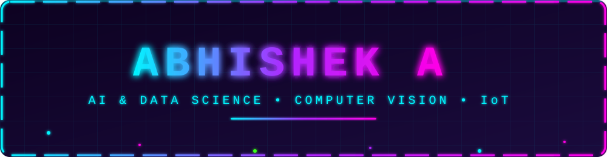

<div align="center">



<a href="https://git.io/typing-svg">
  
</a>

<br/>


<br/><br/>


</div>


## 🧠 `> whoami`

```python
class Abhishek:
    role      = "AI & Data Science Student (B.Tech, 2024–2028)"
    college   = "Sri Ramakrishna Engineering College, Coimbatore"
    focus     = ["Machine Learning", "Computer Vision", "LLM Apps", "IoT"]
    currently = "Building AI-powered products that solve real-world problems"
    loves     = ["YOLO", "TensorFlow Lite", "Streamlit", "ESP32"]

    def mission(self):
        return "Ship intelligent systems, from the cloud to the edge. 🚀"
```

- 🔭 Hands-on with **Machine Learning, Computer Vision, Data Analysis & AI application development**
- 🛠️ Experienced with **YOLO, TensorFlow Lite, Scikit-learn, OpenCV, Pandas, NumPy & Streamlit**
- 🌱 Built projects in **cattle breed classification, face recognition, automated test-case generation & IoT environmental monitoring**
- 🎯 Always learning, always building, always shipping


## ⚡ `Tech Arsenal`

<div align="center">

**💻 Languages**


**🤖 AI / ML / Data**


**🌐 Web & Backend**


**🗄️ Databases & Tools**


<br/>


</div>


## 🚀 `Featured Projects`

<table>
<tr>
<td width="33%" valign="top">

### 🐄 Bovine Scan
*Real-time cattle breed classification*

Computer vision app that identifies cattle breeds in real time, with muzzle biometric recognition and an analytics dashboard for livestock management.


[🔗 View Repository](https://github.com/iamabhishek04/Bovine-Scan)

</td>
<td width="33%" valign="top">

### 🧪 TestGen AI
*LLM-powered test case generation*

Turns software requirements into structured test cases using LLMs, with authentication, history tracking, and filtering.


[🔗 View Repository](https://github.com/iamabhishek04/TestGen-AI)

</td>
<td width="33%" valign="top">

### 🌿 Agrosphere360
*IoT environmental monitoring*

Real-time temperature, humidity and gas monitoring system with live OLED display output.


[🔗 View Repository](https://github.com/iamabhishek04/Agrosphere360)

</td>
</tr>
</table>


## 💼 `Experience`

```text
┌─────────────────────────────────────────────────────────────┐
│  ▶ Node.js Intern          │ Dreams Technologies            │
│    2-week internship · Contributed to the DOCCURE project   │
├─────────────────────────────────────────────────────────────┤
│  ▶ Graphic Design Intern   │ CORIZO EduTech                 │
│    Design fundamentals · Visual content & basic UI concepts │
└─────────────────────────────────────────────────────────────┘
```

## 🎓 `Education`

```text
B.Tech — Artificial Intelligence & Data Science   [ 2024 – 2028 ]
Sri Ramakrishna Engineering College, Coimbatore
```


## 📊 `GitHub Analytics`

<div align="center">


<br/>


</div>

## 🐍 `Contribution Snake`

<div align="center">
  
</div>


## 📡 `Connect With Me`

<div align="center">

<a href="https://linkedin.com/in/abhishek-a-76ba19358">
  
</a>
<a href="mailto:abhishekarockiaraj@gmail.com">
  
</a>
<a href="https://github.com/iamabhishek04">
  
</a>

<br/><br/>


</div>
